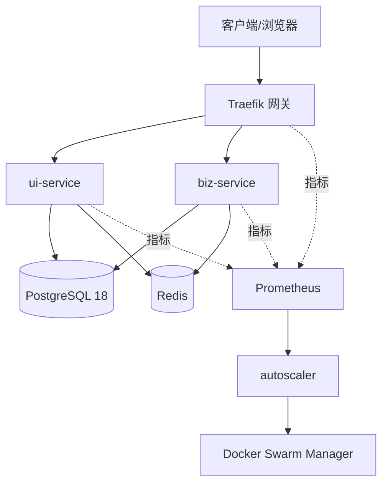

# 变更提案: docker-compose-spring-stack-autoscaling

## 元信息
```yaml
类型: 新功能
方案类型: implementation
优先级: P1
状态: 待实施
创建: 2026-03-06
更新: 2026-03-06 10:07:54 UTC
推荐方案: 方案C：三层分域 + Compose 到 Swarm 的渐进弹性方案
复核结论: Claude 评审 = 条件可行
```

---

## 1. 需求

### 背景
当前需要为一套由 PostgreSQL 18、Redis、`ui-service`、`biz-service` 组成的 Spring Boot 服务栈建立可直接交付的容器化部署路径。团队明确不引入 Kubernetes，但又希望后续具备自动扩缩容能力。如果一开始就引入完整的 Swarm 监控与自动扩缩容链路，会显著提高首批交付复杂度；如果只做单纯的 Compose，又无法为后续弹性演进留下统一约束。

结合可行性复核意见，本方案继续采用“先 Compose 落地、再向 Swarm 渐进升级”的双阶段路径，但补强以下关键缺口：
- 明确 autoscaler 的技术选型与防抖/失败保护逻辑。
- 增加 `ui-service` / `biz-service` 的无状态验证闸门。
- 增加 Compose → Swarm 映射表，避免把迁移复杂度留到实施阶段。
- 增加 PostgreSQL 18 / Redis 的备份、恢复、演练与责任边界。

### 目标
- 以“三层分域”方式明确入口层、应用层、数据层的职责边界，并据此规划网络、配置和部署目录结构。
- 阶段1基于 Docker Compose 落地 Traefik、PostgreSQL 18、Redis、`ui-service`、`biz-service`，支持单宿主机部署与手动扩容。
- 阶段2在不引入 Kubernetes 的前提下，演进到 Docker Swarm、Prometheus 指标采集与 autoscaler 自动扩缩容。
- 为后续开发实施提供可执行的目录结构、配置文件清单、验证命令、回滚方式、备份恢复方式与验收基线。

### 约束条件
```yaml
时间约束:
  - 首批交付必须优先完成阶段1（Compose 直接落地），确保在单宿主机环境中可部署、可验证、可回滚。
  - 阶段2为增强能力，允许在阶段1稳定后单独推进，不作为首批阻断项。
性能约束:
  - 应用层服务必须保持无状态，或将会话/缓存状态外置到 Redis，确保 `ui-service` 与 `biz-service` 支持横向扩展。
  - 网关需要支持对多个应用副本进行转发，健康检查需能区分存活性与就绪性。
  - PostgreSQL 连接池总预算必须受控，避免应用副本增加后打满数据库连接数。
兼容性约束:
  - 不引入 Kubernetes；编排能力限定在 Docker Compose v2 与 Docker Swarm。
  - 数据层固定包含 PostgreSQL 18 与 Redis，应用层固定为 `ui-service` 与 `biz-service` 两个 Spring Boot 服务。
  - 阶段1与阶段2尽量复用相同的镜像标签、环境变量命名、健康检查路径与路由规则。
业务约束:
  - 方案必须适用于研发、测试或单机生产样板环境，不能依赖云厂商托管中间件。
  - 数据持久化、备份恢复、回滚步骤与验收检查必须在方案中明确定义。
  - 阶段1若未完成无状态验证与备份恢复演练，不允许以“可扩容”名义上线。
```

### 验收标准
- [ ] 阶段1可通过 `docker compose up -d` 启动 Traefik、PostgreSQL 18、Redis、`ui-service`、`biz-service`，并在单宿主机环境进入健康状态。
- [ ] `ui-service` 与 `biz-service` 都能通过环境变量正确连接 PostgreSQL 18 与 Redis，且暴露可被 Docker 与网关调用的健康检查端点。
- [ ] 阶段1支持至少一次手动扩容演练，例如 `docker compose up -d --scale ui-service=2 --scale biz-service=2`，并验证流量分发、状态外置与数据库连接预算成立。
- [ ] 阶段1必须完成无状态验证清单与 PostgreSQL/Redis 备份恢复演练，形成可执行记录。
- [ ] 网络、卷、初始化脚本、环境变量模板、启动顺序、路由回归检查与验证脚本均已规划完成，足以支撑后续开发实施直接创建文件。
- [ ] 阶段2在启用时可通过 `docker stack deploy`、Prometheus 与 autoscaler 对 `ui-service` 与 `biz-service` 执行自动扩缩容，且不依赖 Kubernetes。
- [ ] autoscaler 具备最小/最大副本、冷却时间、失败冻结、dry-run、单次步进与并发保护，不会在指标异常时错误缩容。
- [ ] 回滚步骤、验收清单与阶段边界已明确：阶段1为首批阻断项，阶段2为可选增强项。

---

## 2. 方案

### 技术方案
本方案采用“方案C：三层分域 + Compose 到 Swarm 的渐进弹性方案”，按入口层、应用层、数据层拆分部署职责，并以相同的镜像与配置约定贯穿两个实施阶段。

#### 总体策略
- **入口层（Edge）**：默认采用 Traefik 作为统一入口与负载分发层，负责外部访问、Host/Path 路由、TLS 入口与服务发现。阶段1由 Compose 管理，阶段2改为 Swarm service 标签驱动发现。
- **应用层（App）**：`ui-service` 与 `biz-service` 分别独立构建 Spring Boot 容器镜像，使用统一环境变量模板注入 PostgreSQL 18、Redis、日志级别、端口与健康检查配置。阶段1支持手动扩容，阶段2接入自动扩缩容。
- **数据层（Data）**：PostgreSQL 18 与 Redis 在阶段1先以单实例持久化方式部署，使用命名卷保存数据，并补齐初始化脚本、备份恢复与健康检查。阶段2仍保持数据层稳定，不将数据库和缓存纳入自动扩缩容对象。

#### 阶段1：Compose 直接落地
- 规划 `deploy/compose/` 目录、`.env.example`、`docker-compose.yml`、Traefik 配置、数据库初始化目录、Redis 配置、验证脚本与手动扩容命令，保证单机部署即开即用。
- 在进入多副本演练前，先完成 `ui-service` / `biz-service` 的无状态审计，明确 Session、临时文件、本地缓存、定时任务与数据库连接池上限。
- 明确 PostgreSQL 18 与 Redis 的备份频率、保留策略、恢复负责人和恢复演练步骤，避免阶段1把数据层风险留空。

#### 阶段2：Swarm 渐进增强
- 在 `deploy/swarm/` 与 `deploy/monitoring/` 中补齐 `docker-stack.yml`、overlay 网络、configs/secrets、Prometheus 与 autoscaler 服务配置，使阶段1产物可平滑演进，而不是推倒重来。
- autoscaler 技术选型固定为：**Python 3.12 + docker SDK（docker-py）+ Prometheus HTTP API + Redis 分布式锁**。
- autoscaler 只允许作用于 `ui-service` 与 `biz-service`，并采用固定的失败保护：指标缺失冻结缩容、单次步进仅 ±1、副本冷却窗口、最小/最大副本限制、dry-run 开关。

### 影响范围
```yaml
涉及模块:
  - deploy/compose: Compose 基础编排、网络与卷、环境变量模板
  - deploy/compose/traefik: 网关入口、路由规则、证书与转发策略
  - deploy/compose/postgres: PostgreSQL 18 初始化、持久化、备份恢复基线
  - deploy/compose/redis: Redis 配置、持久化与安全参数
  - ui-service: 容器镜像构建、运行时环境变量、无状态校验、健康检查约定
  - biz-service: 容器镜像构建、运行时环境变量、无状态校验、健康检查约定
  - deploy/swarm: Stack 编排、overlay 网络、service 标签、副本策略与迁移映射表
  - deploy/monitoring: Prometheus、指标采集、autoscaler 规则、告警与保护开关
  - deploy/scripts: 验证、扩容、回滚、恢复演练与 dry-run 脚本
预计变更文件: 16-24
```

### 风险评估
| 风险 | 等级 | 应对 |
|------|------|------|
| `ui-service` / `biz-service` 仍存在本地状态，横向扩容后会话漂移 | 高 | 在阶段1加入无状态审计清单与多副本压测，未通过则禁止进行扩容验收 |
| autoscaler 规则抖动导致频繁扩缩容 | 高 | 固定单次步进、冷却窗口、最小/最大副本、指标缺失冻结与 dry-run 验证 |
| Compose → Swarm 迁移时网络/服务发现不兼容 | 中 | 在方案包内补齐映射表，提前区分 bridge/overlay、容器名/service 名、env_file/configs/secrets |
| PostgreSQL 18 / Redis 单实例故障导致不可用 | 中 | 补齐备份、恢复脚本、恢复责任人与演练要求；阶段2再评估高可用增强 |
| Traefik 标签与动态路由在阶段切换时失效 | 中 | 将 Traefik 路由回归测试纳入阶段1和阶段2验证任务 |
| 应用扩容后数据库连接数超预算 | 中 | 在 `ui-service` / `biz-service` 的无状态与运行配置任务中明确连接池上限与预算分配 |

---

## 3. 技术设计（可选）

> 涉及架构变更、API设计、数据模型变更时填写

### 架构设计


### 部署拓扑
```yaml
网络规划:
  - edge: Traefik 对外入口网络
  - app: `ui-service` 与 `biz-service` 的应用网络
  - data: PostgreSQL 18 与 Redis 的数据访问网络
  - monitor: Prometheus、autoscaler 与 exporter 的监控网络（阶段2启用）
卷规划:
  - postgres_data: PostgreSQL 18 主数据卷
  - redis_data: Redis AOF/RDB 数据卷
  - traefik_letsencrypt: Traefik 证书与 ACME 数据
  - backup_data: 数据层备份落盘目录
```

### API设计
#### GET /
- **请求**: 外部访问网关根路径，由 Traefik 根据 Host/Path 规则转发到 `ui-service`。
- **响应**: `ui-service` 首页或聚合后的前端响应，阶段1与阶段2均保持同一路由入口。

#### ANY /api/**
- **请求**: 网关将 `/api/**` 路由到 `biz-service`，用于承接后端业务 API。
- **响应**: `biz-service` 的 JSON/HTTP 业务响应；网关层不做业务改写，仅处理转发与负载分发。

#### GET /actuator/health/liveness
- **请求**: 由 Docker 健康检查、Swarm service 检测或运维脚本调用。
- **响应**: Spring Boot 存活状态；失败时触发容器重启或从负载池摘除。

#### GET /actuator/health/readiness
- **请求**: 由网关探测、发布验证脚本或自动扩缩容前置检查调用。
- **响应**: Spring Boot 就绪状态；仅在数据库、缓存与必要依赖可用时返回就绪。

### 数据模型
| 字段 | 类型 | 说明 |
|------|------|------|
| service_name | string | 服务名，如 `traefik`、`ui-service`、`biz-service`、`postgres`、`redis`、`prometheus`、`autoscaler` |
| layer | enum(edge/app/data/monitoring) | 所属层级，用于界定网络与职责边界 |
| runtime_mode | enum(compose/swarm/both) | 服务适用的运行模式：仅 Compose、仅 Swarm 或两者共用 |
| replica_policy | string | 副本策略，如 `manual:1->N`、`auto:min=2,max=6` |
| network_scope | string | 所属网络，如 `edge`、`app`、`data`、`monitor` |
| volume_binding | string | 绑定的命名卷；无状态服务可为空 |
| health_endpoint | string | 健康检查命令或 HTTP 路径 |
| rollback_anchor | string | 回滚锚点，如镜像 tag、Compose 文件版本、Stack 发布版本 |

### 配置布局
```text
deploy/
├── compose/
│   ├── docker-compose.yml
│   ├── .env.example
│   ├── traefik/
│   │   ├── traefik.yml
│   │   └── dynamic/
│   ├── postgres/
│   │   ├── initdb/
│   │   ├── backup/
│   │   └── restore/
│   └── redis/
│       ├── redis.conf
│       └── backup/
├── swarm/
│   ├── docker-stack.yml
│   ├── mapping.md
│   ├── configs/
│   └── secrets/
├── monitoring/
│   ├── prometheus/
│   │   └── prometheus.yml
│   └── autoscaler/
│       ├── Dockerfile
│       ├── requirements.txt
│       ├── app.py
│       └── config.yaml
└── scripts/
    └── ops/
        ├── validate-compose.sh
        ├── scale-compose.sh
        ├── backup-postgres.sh
        ├── restore-postgres.sh
        ├── backup-redis.sh
        ├── deploy-swarm.sh
        └── rollback.sh
```

### 无状态验证清单
| 检查项 | `ui-service` | `biz-service` | 通过标准 |
|------|------|------|------|
| Session 是否外置到 Redis 或改为 JWT | 必须 | 可选 | 多副本切换后用户会话不丢失 |
| 是否存在本地文件写入作为业务状态 | 禁止 | 禁止 | 容器删除后业务状态不丢失 |
| 是否存在仅保存在内存中的共享缓存 | 禁止 | 禁止 | 横向扩容后结果一致 |
| 是否存在单机定时任务/锁竞争 | 可有但需外置锁 | 可有但需外置锁 | 多副本下任务不重复执行 |
| 数据库连接池预算是否明确 | 必须 | 必须 | 总连接数 ≤ PostgreSQL 预算 |
| readiness 是否检查依赖可用性 | 必须 | 必须 | 依赖不可用时不进入负载池 |

### Compose → Swarm 映射表
| Compose 概念 | Swarm 对应方式 | 迁移说明 |
|------|------|------|
| bridge 网络 | overlay 网络 | `edge/app/data/monitor` 分别创建 overlay 网络 |
| `docker compose up --scale` | `docker service scale` | 手动扩容命令切换为 service 级别 |
| `env_file` | configs/secrets + 环境变量 | 敏感信息优先转 secrets |
| 容器名直连 | service 名 / VIP | 不依赖单容器名称 |
| `depends_on` | 健康检查 + 就绪门控 | Swarm 不保证启动顺序，用 readiness 接管 |
| bind/named volume | 命名卷 / 节点约束 | 数据层需固定到特定节点 |
| Traefik Docker labels | Traefik Swarm labels | 标签命名保持一致，减少迁移改动 |

### autoscaler 设计
```yaml
技术选型:
  language: Python 3.12
  runtime: 容器化部署
  dependencies:
    - docker SDK for Python（调用 Docker Engine API）
    - requests / httpx（查询 Prometheus HTTP API）
    - redis-py（分布式锁，防止多实例并发扩缩容）
部署形态:
  - 阶段2初期以 1 副本运行，绑定 Swarm manager 节点
  - 若需要高可用，可扩为 2 副本，但仅持有 Redis 锁的实例执行缩放
决策周期:
  - 30 秒采集一次指标
  - 连续 3 个窗口满足扩容条件才扩容
  - 连续 10 分钟满足缩容条件才缩容
保护策略:
  - min/max replicas
  - cooldown_seconds
  - stabilization_window
  - dry_run 开关
  - metrics_missing_freeze=true
  - single_step_per_cycle=1
扩容指标:
  - `ui-service`: CPU、HTTP p95、请求量、5xx 比例
  - `biz-service`: CPU、HTTP p95、请求量、可选队列积压量
缩容前置:
  - 目标实例 readiness 连续稳定
  - 当前错误率未超阈值
  - 冷却窗口已结束
```

### 备份与恢复基线
| 组件 | 备份策略 | 保留策略 | 恢复要求 | 责任人 |
|------|------|------|------|------|
| PostgreSQL 18 | 每日 02:30 UTC 执行 `pg_dump`；每次发布前额外做一次快照 | 保留 7 份日备份 + 4 份周备份 | 每月至少完成 1 次恢复演练 | 部署负责人 |
| Redis | `appendonly yes` + `appendfsync everysec`；每日 03:00 UTC 保留一次 RDB 快照 | 保留 3 份日快照 | 每月至少验证 1 次 AOF/RDB 恢复可用 | 部署负责人 |
| Compose / Stack 配置 | 每次发布打 tag 或归档配置版本 | 保留最近 10 次发布版本 | 回滚时必须能恢复到上一稳定版本 | 开发负责人 |

---

## 4. 核心场景

> 执行完成后同步到对应模块文档

### 场景: 单机 Compose 首次部署
**模块**: `deploy/compose` 及入口层/数据层基础配置
**条件**: Docker Engine 与 Docker Compose v2 已安装，`.env` 已按模板填写，镜像可构建或可拉取。
**行为**: 运维执行 `docker compose up -d`，Traefik、PostgreSQL 18、Redis、`ui-service`、`biz-service` 依次启动，数据库初始化脚本与健康检查生效。
**结果**: 全部服务处于健康状态，外部请求可经 Traefik 到达 `ui-service` 与 `biz-service`。

### 场景: 阶段1手动扩容应用副本
**模块**: `ui-service`、`biz-service`、Traefik 路由与 Redis 状态外置
**条件**: 阶段1已部署完成，服务满足无状态扩展前提，数据库连接预算已配置。
**行为**: 运维执行 `docker compose up -d --scale ui-service=2 --scale biz-service=2`，并运行路由探活和错误率检查脚本。
**结果**: Traefik 将流量分发到多个副本；数据库与缓存连接稳定；扩容不会破坏用户请求链路。

### 场景: PostgreSQL / Redis 故障后的恢复演练
**模块**: `deploy/compose/postgres`、`deploy/compose/redis`、`scripts/ops`
**条件**: 已完成日常备份，恢复脚本与恢复目标路径可用。
**行为**: 运维执行 PostgreSQL 或 Redis 的恢复脚本，在隔离环境或演练环境中恢复最近备份，并重新执行健康检查。
**结果**: 数据层可恢复到指定备份点，恢复时间与步骤可留档复用。

### 场景: 阶段2自动扩缩容
**模块**: `deploy/swarm`、`deploy/monitoring`、autoscaler
**条件**: Swarm 已初始化，Prometheus 指标可采集，autoscaler 已配置最小/最大副本、冷却时间、dry-run 与分布式锁。
**行为**: autoscaler 根据 Prometheus 暴露的 CPU、内存或请求量指标执行 `docker service scale`，动态调整 `ui-service`、`biz-service` 副本数。
**结果**: 应用层在阈值范围内自动扩缩容；缩容过程遵循冷却时间与健康检查，不影响已有流量。

### 场景: 发布失败后的快速回滚
**模块**: `scripts/ops`、Compose/Swarm 编排文件、命名卷管理
**条件**: 新镜像或新配置导致服务异常、健康检查失败或接口不可用。
**行为**: 运维根据回滚脚本与版本锚点切换回上一个镜像 tag/编排版本，保留 PostgreSQL 18 与 Redis 数据卷，重新执行健康检查与路由验证。
**结果**: 服务恢复到上一稳定版本，数据不丢失，回滚步骤可重复执行并留痕。

---

## 5. 技术决策

> 本方案涉及的技术决策，归档后成为决策的唯一完整记录

### docker-compose-spring-stack-autoscaling#D001: 以三层分域 + Traefik 作为统一入口
**日期**: 2026-03-06
**状态**: ✅采纳
**背景**: 方案需要同时兼顾 Compose 单机落地与 Swarm 演进，入口层必须支持动态路由、服务发现与多副本分发，同时避免在阶段切换时重写全部网关配置。
**选项分析**:
| 选项 | 优点 | 缺点 |
|------|------|------|
| A: 直接暴露 `ui-service` / `biz-service` 端口 | 配置简单、上手快 | 路由分散，不利于扩容与统一入口控制 |
| B: 使用 Nginx 作为静态网关 | 生态成熟、配置直观 | Compose 到 Swarm 迁移时动态发现能力较弱，配置维护成本较高 |
| C: 使用 Traefik 作为统一入口（推荐） | 支持标签驱动发现、适合 Compose/Swarm 双模式、便于多副本流量分发 | 需要统一标签与动态配置规范 |
**决策**: 选择方案C
**理由**: Traefik 最适合承担入口层职责，既能满足阶段1的快速落地，也能在阶段2通过 service labels 继续复用，降低迁移成本。
**影响**: 影响 `deploy/compose/traefik`、`deploy/swarm/docker-stack.yml`、服务标签与健康检查策略。

### docker-compose-spring-stack-autoscaling#D002: 采用“阶段1 Compose、阶段2 Swarm”的渐进式编排路径
**日期**: 2026-03-06
**状态**: ✅采纳
**背景**: 团队明确不引入 Kubernetes，但仍需要一条可逐步增强的弹性部署路径。单独选择 Compose 或一步到位选择复杂编排都无法同时满足速度与扩展性。
**选项分析**:
| 选项 | 优点 | 缺点 |
|------|------|------|
| A: 只做 Docker Compose | 交付快、调试简单 | 无自动扩缩容，后续弹性增强需要重新设计 |
| B: 直接上 Kubernetes | 扩展能力最强、生态完整 | 超出约束条件，引入运维成本与复杂度 |
| C: 先 Compose 落地，再向 Swarm 演进 | 首批交付快，且保留自动扩缩容演进空间 | 需要提前规划配置复用与迁移边界 |
**决策**: 选择方案C
**理由**: 该路径最符合“不引入 Kubernetes、先落地再增强”的业务目标，既保证阶段1快速可用，也为阶段2预留扩展路线。
**影响**: 影响目录结构、环境变量命名、Compose/Swarm 配置拆分与任务优先级。

### docker-compose-spring-stack-autoscaling#D003: PostgreSQL 18 与 Redis 采用单实例持久化基线，不参与自动扩缩容
**日期**: 2026-03-06
**状态**: ✅采纳
**背景**: 自动扩缩容的主要收益来自无状态应用层；数据库与缓存在首批交付中更应关注稳定性、持久化与恢复路径，而不是复杂的高可用拓扑。
**选项分析**:
| 选项 | 优点 | 缺点 |
|------|------|------|
| A: PostgreSQL/Redis 也随平台一起横向扩展 | 看似统一弹性策略 | 状态一致性复杂，超出当前目标 |
| B: 直接使用外部托管 PostgreSQL/Redis | 可降低本地运维负担 | 不符合本次“Compose 直接部署完整栈”的目标 |
| C: 以单实例 + 命名卷 + 备份恢复为首批基线 | 落地简单、可控、便于回滚 | 阶段1存在单点，需要后续专项高可用增强 |
**决策**: 选择方案C
**理由**: 数据层优先保证稳定与可恢复性，自动扩缩容只作用于 `ui-service` 和 `biz-service`，有利于控制实施复杂度。
**影响**: 影响 `deploy/compose/postgres`、`deploy/compose/redis`、回滚脚本与验收标准。

### docker-compose-spring-stack-autoscaling#D004: 自动扩缩容基于 Prometheus 指标 + 自定义 autoscaler，而非引入 Kubernetes 生态组件
**日期**: 2026-03-06
**状态**: ✅采纳
**背景**: 阶段2需要在 Swarm 环境下实现自动扩缩容，但约束条件明确排除 Kubernetes，因此需要一种能直接利用 Docker API 与 Prometheus 指标的轻量方案。
**选项分析**:
| 选项 | 优点 | 缺点 |
|------|------|------|
| A: 继续完全手动扩容 | 实现最简单 | 无法满足自动弹性目标 |
| B: 引入 KEDA/HPA 等 Kubernetes 生态方案 | 能力成熟 | 与“不引入 Kubernetes”的约束冲突 |
| C: Prometheus + 自定义 autoscaler 调用 Docker API / `docker service scale` | 满足约束、可控、可逐步迭代 | 需要自行定义阈值、冷却时间与失败保护 |
**决策**: 选择方案C
**理由**: 该方案在 Swarm 体系内即可闭环，不需要额外平台迁移，同时保留禁用 autoscaler 后回退到人工扩容的能力。
**影响**: 影响 `deploy/monitoring/prometheus`、`deploy/monitoring/autoscaler`、Swarm service 标签与运维脚本。

### docker-compose-spring-stack-autoscaling#D005: autoscaler 固定采用 Python 3.12 + docker SDK + Prometheus HTTP API + Redis 锁
**日期**: 2026-03-06
**状态**: ✅采纳
**背景**: Claude 复核指出 autoscaler 是阶段2的核心组件，但原方案只写了“轻量脚本”，缺少语言选型、依赖库、并发保护与失败机制。
**选项分析**:
| 选项 | 优点 | 缺点 |
|------|------|------|
| A: Bash 脚本 + CLI 命令 | 简单直接 | 错误处理、并发保护和可测试性较弱 |
| B: Go 服务 | 性能好、可编译单文件 | 首批实现成本更高，团队维护门槛较高 |
| C: Python 3.12 服务 + docker SDK + Prometheus HTTP API + Redis 锁 | 实现快、依赖成熟、易于做 dry-run、日志和单元测试 | 需要维护 Python 运行时镜像 |
**决策**: 选择方案C
**理由**: Python 在实现速度、可读性、HTTP/API 生态和 Docker API 访问上最平衡；Redis 锁可以解决多实例并发执行缩放的问题。
**影响**: 影响 `deploy/monitoring/autoscaler/` 的实现语言、镜像、配置结构与测试方式。

### docker-compose-spring-stack-autoscaling#D006: 阶段1上线前必须通过无状态验证与备份恢复演练
**日期**: 2026-03-06
**状态**: ✅采纳
**背景**: Claude 复核指出原方案默认服务可无状态扩容、数据层可恢复，但没有把验证动作设为上线前置条件，存在较大落地风险。
**选项分析**:
| 选项 | 优点 | 缺点 |
|------|------|------|
| A: 只在文档中提醒，不设强制闸门 | 交付更快 | 风险会在上线后暴露 |
| B: 把验证作为首批阻断项 | 风险前移、质量更稳 | 需要额外时间做审计与演练 |
| C: 阶段1先忽略，阶段2再补 | 早期省时 | 会让多副本与数据恢复能力名不副实 |
**决策**: 选择方案B
**理由**: 阶段1本身就包含手动扩容与回滚诉求，如果无状态验证和恢复演练缺位，方案在实践上并不成立。
**影响**: 影响 `ui-service`、`biz-service`、`deploy/compose/postgres`、`deploy/compose/redis` 与验收步骤的优先级排序。
