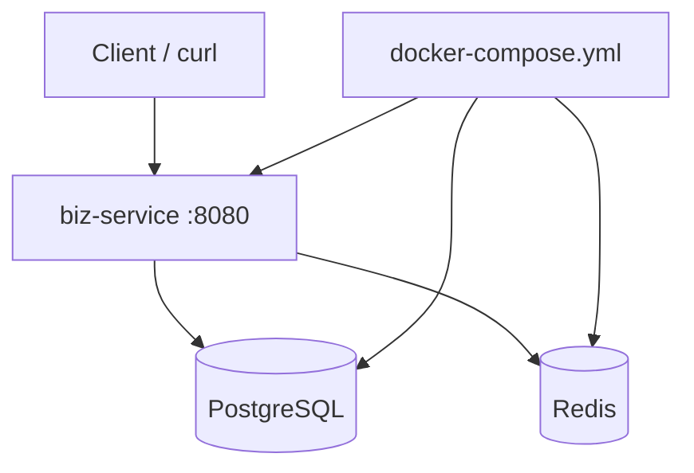

# 变更提案: biz-service-pg-redis-compose

## 元信息
```yaml
类型: 新功能
方案类型: implementation
优先级: P1
状态: 待实施
创建: 2026-03-11
更新: 2026-03-11 04:45:03 UTC
推荐方案: 唯一方案：为 biz-service 接入 PostgreSQL 与 Redis，并以 docker-compose 提供一键联调环境
```

---

## 1. 需求

### 背景
当前仓库已存在一个最小可运行的 `biz-service` Spring Boot 单服务样板，具备基础健康接口、测试接口与 Docker 镜像构建能力，但尚未接入 PostgreSQL 与 Redis，也没有提供一键同时启动应用、数据库和缓存的 Compose 编排。

用户希望在现有服务上继续扩展：
- 接入 PostgreSQL 与 Redis；
- 提供能够验证 PostgreSQL / Redis 是否可用的接口；
- 新增 Docker Compose，在启动时同时拉起 `biz-service`、PostgreSQL 和 Redis。

### 目标
- 为 `biz-service` 增加 PostgreSQL JDBC 与 Redis 连接能力。
- 提供验证 PostgreSQL / Redis 可用性的接口，并将依赖状态纳入健康返回。
- 新增 `docker-compose.yml`，支持一键启动 `biz-service`、`postgres`、`redis`。
- 保持服务在依赖暂不可用时仍可启动，以便通过接口观察依赖状态。
- 补充自动化测试与容器联调验证。

### 约束条件
```yaml
时间约束:
  - 基于现有 biz-service 做增量改造，不重建整体工程结构。
性能约束:
  - 依赖探测逻辑应尽量轻量，避免在普通测试接口里引入重查询。
兼容性约束:
  - 继续使用 Spring Boot 3.4.0、Java 21、Maven。
  - 宿主机无 Java / Maven 时，仍需可通过 Docker / Docker Compose 完成构建与验证。
业务约束:
  - 必须提供能直接判断 PostgreSQL 与 Redis 是否可用的接口。
  - Compose 启动时必须同时包含应用、PostgreSQL 和 Redis 三个服务。
```

### 验收标准
- [ ] `biz-service` 已引入 PostgreSQL 与 Redis 所需依赖和配置。
- [ ] `GET /api/health` 能返回应用本身状态以及 PostgreSQL / Redis 可用性摘要。
- [ ] 存在专门的依赖验证接口（如 `GET /api/dependencies`），返回 PostgreSQL 和 Redis 的探测结果。
- [ ] `docker-compose.yml` 启动后能同时拉起 `biz-service`、`postgres`、`redis`。
- [ ] 应用在 Compose 环境下能成功连通 PostgreSQL 与 Redis，并通过接口返回可用状态。
- [ ] 至少包含一组自动化测试覆盖依赖状态接口的核心返回结构。

---

## 2. 方案

### 技术方案
采用“最小接入 + 运行时探测”的方式：
- PostgreSQL 通过 `spring-boot-starter-jdbc` + `org.postgresql:postgresql` 接入，运行时使用轻量 SQL（`SELECT 1`）验证连通性；
- Redis 通过 `spring-boot-starter-data-redis` 接入，运行时通过 `RedisConnectionFactory` 执行 `PING` 验证连通性；
- 新增依赖状态服务，统一汇总 PostgreSQL / Redis 的探测结果；
- 扩展 `GET /api/health`，把应用状态与依赖状态一起返回；
- 新增 `GET /api/dependencies` 专门返回 PostgreSQL / Redis 探测详情；
- 新增根目录 `docker-compose.yml`，使用 `postgres:16-alpine` 与 `redis:7-alpine`，并通过环境变量向 `biz-service` 注入连接信息；
- 为避免依赖短暂不可用导致应用无法启动，对数据源初始化做“延迟失败”配置，使应用可先启动、再由接口反馈依赖状态。

### 影响范围
```yaml
涉及模块:
  - biz-service: 新增 PostgreSQL / Redis 依赖、配置、探测服务、接口与测试
  - compose-runtime: 新增 docker-compose 本地联调编排
  - knowledge-base: 同步更新 biz-service 与项目上下文事实
预计变更文件: 12~18
```

### 风险评估
| 风险 | 等级 | 应对 |
|------|------|------|
| PostgreSQL 未就绪时 DataSource 初始化导致应用启动失败 | 中 | 配置 Hikari 初始化延迟失败，并在接口中单独报告依赖不可用 |
| Redis / PostgreSQL 容器已启动但健康未完全就绪 | 中 | Compose 中为依赖服务增加 healthcheck，并让 biz-service 依赖健康状态 |
| 宿主机没有 Java / Maven 无法本地跑测试 | 低 | 使用 Docker 多阶段构建与 Compose 联调完成验证 |

---

## 3. 技术设计

### 架构设计


### API设计
#### GET /api/health
- **用途**: 返回应用自身状态与依赖摘要。
- **响应**: 包含应用状态、启动完成标记、PostgreSQL 状态、Redis 状态、时间戳等字段。

#### GET /api/dependencies
- **用途**: 详细验证 PostgreSQL 与 Redis 是否可用。
- **响应**: 包含 `postgres`、`redis` 两个对象，各自带 `available`、`status`、`details` 等字段。

### 数据模型
| 字段 | 类型 | 说明 |
|------|------|------|
| available | boolean | 依赖是否可用 |
| status | String | `UP` / `DOWN` / `UNKNOWN` |
| details | String | 错误原因或成功说明 |
| checkedAt | Instant | 本次探测时间 |

---

## 4. 核心场景

### 场景: 本地一键启动应用与依赖
**模块**: biz-service / compose-runtime
**条件**: 执行 `docker compose up --build`
**行为**: Compose 同时启动 PostgreSQL、Redis、biz-service，并注入连接参数
**结果**: 应用可通过接口返回自身与依赖状态

### 场景: 依赖状态验证
**模块**: biz-service
**条件**: 应用已启动
**行为**: 调用 `/api/dependencies` 或 `/api/health`
**结果**: 可以直接看到 PostgreSQL 与 Redis 当前是否可用

---

## 5. 技术决策

### biz-service-pg-redis-compose#D001: 采用运行时主动探测而非把依赖可用性完全绑定到应用启动成功
**日期**: 2026-03-11
**状态**: ✅采纳
**背景**: 用户希望通过接口验证 PostgreSQL 与 Redis 是否可用，如果把依赖连接失败直接升级为应用启动失败，就无法通过接口观察依赖状态变化。
**选项分析**:
| 选项 | 优点 | 缺点 |
|------|------|------|
| A: 启动时强依赖 PostgreSQL/Redis，失败则应用直接退出 | 失败暴露早，配置简单 | 无法在接口层面查看依赖故障详情 |
| B: 应用允许启动，运行时主动探测 PostgreSQL/Redis 可用性 | 更符合“验证接口”需求，便于本地联调与排障 | 需要额外探测代码与状态建模 |
**决策**: 选择方案 B
**理由**: 既满足接口验证诉求，也更适合本地 Compose 联调场景。
**影响**: `biz-service` 配置、依赖探测服务、健康接口、Compose 启动顺序与测试策略。
