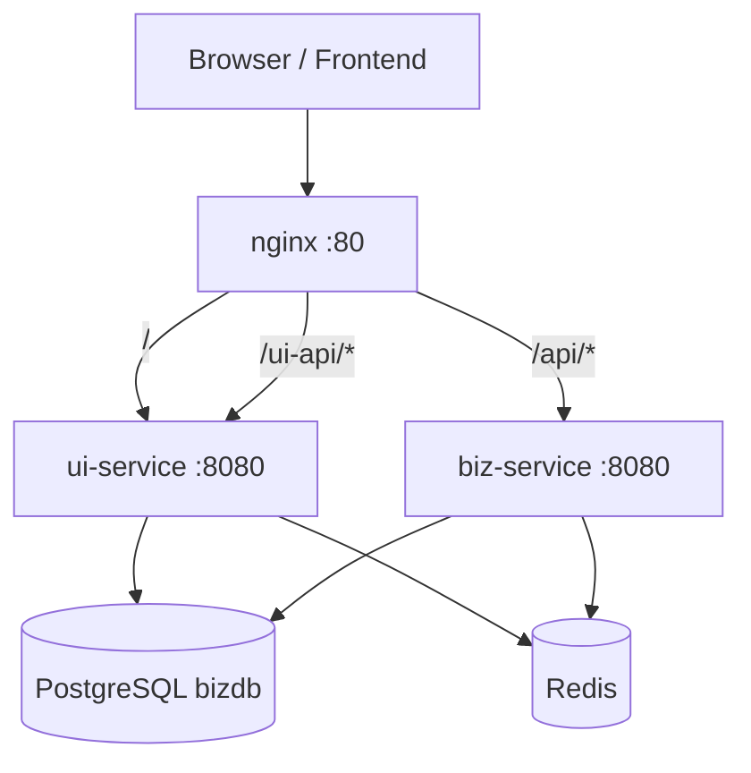

# 变更提案: ui-biz-nginx-compose-gateway

## 元信息
```yaml
类型: 新功能
方案类型: implementation
优先级: P1
状态: 已完成
创建: 2026-03-11
更新: 2026-03-11 09:40:00 UTC
推荐方案: 方案A：职责分层双直连（ui-service 与 biz-service 同时接入 PostgreSQL/Redis，但按接口职责与数据命名空间隔离）
```

---

## 1. 需求

### 背景
当前仓库已经存在一个真实可运行的 `biz-service`，并已通过根目录 `docker-compose.yml` 同时拉起 `postgres`、`redis`、`biz-service` 三个服务。`biz-service` 已具备健康检查、依赖检查、PostgreSQL notes 真实读写接口和 Redis KV 真实读写接口。

本轮目标是在这个基线上继续扩展两个组件：
- 一个新的 `ui-service`
- 一个新的 `nginx`

用户明确的业务边界是：
- `ui-service` 与 `biz-service` **都会访问 PostgreSQL 和 Redis**；
- `ui-service` 提供的是**面向前端交互**的接口；
- `biz-service` 提供的是**业务数据处理相关**的接口；
- 两者职责不同，不冲突；
- `nginx` 作为统一入口，把前端交互入口转发到 `ui-service`，把 `/api` 转发到 `biz-service`。

### 目标
- 新增一个基于 Spring Boot 3.4.0 / Java 21 的 `ui-service`，复用当前技术栈与 Docker 构建方式。
- 为 `ui-service` 接入 PostgreSQL 与 Redis，并提供真实读写能力与可观测接口。
- 保持 `biz-service` 作为业务处理服务，继续承载已有 `/api/*` 接口与 PG/Redis 真实读写能力。
- 新增 `nginx`，作为统一对外入口，完成 `ui-service` 与 `biz-service` 的反向代理分流。
- 修改根目录 `docker-compose.yml`，使 `docker-compose up -d --build` 能同时启动 `ui-service`、`biz-service`、`postgres`、`redis`、`nginx` 共 5 个服务。

### 约束条件
```yaml
时间约束:
  - 优先基于当前真实仓库快速落地，不推翻现有 biz-service 的已验证能力。
性能约束:
  - UI 与 Biz 服务都可访问 PostgreSQL/Redis，但不得共同写入同一批核心业务数据。
兼容性约束:
  - 保持现有 Spring Boot 3.4.0、Java 21、Maven、多阶段 Docker 镜像构建方式一致。
  - 保持现有 biz-service /api 路径可继续通过 nginx 访问，不强制整体改造成新版本前缀。
业务约束:
  - ui-service 面向前端交互，不应变成 biz-service 的透明转发壳。
  - biz-service 面向业务数据处理，不应继续承接前端专属交互接口。
  - PostgreSQL 与 Redis 在 compose 中仍然是单实例基线，通过表名/键前缀区分两个服务的数据边界。
```

### 验收标准
- [x] `docker-compose up -d --build` 后可同时启动 `ui-service`、`biz-service`、`postgres`、`redis`、`nginx` 五个服务。
- [x] `ui-service` 与 `biz-service` 都能通过接口返回自身健康状态、启动状态与 PostgreSQL/Redis 可用性。
- [x] `ui-service` 提供了一组面向前端交互的 PostgreSQL 真实读写接口，以及一组 Redis 真实读写接口。
- [x] `biz-service` 现有 `/api/health`、`/api/dependencies`、PostgreSQL notes 与 Redis KV 接口在 nginx 代理后仍可正常访问。
- [x] nginx 能将 `/api/*` 转发到 `biz-service`，并将 `/` 与 `/ui-api/*` 转发到 `ui-service`。
- [x] 已补充 `ui-service` 的 WebMvc 测试，并完成 compose 联调验证，确认五个容器能进入可用状态。

---

## 2. 方案

### 技术方案
采用“**职责分层双直连**”方案：

- **ui-service**：新增一个独立的 Spring Boot 服务，提供前端交互型 API，例如页面偏好、前端会话态、轻量交互数据等；该服务直接访问 PostgreSQL/Redis，但仅读写自己职责范围内的数据。
- **biz-service**：保留当前服务及其 `/api/*` 路径、业务数据处理能力、现有 PostgreSQL notes 与 Redis KV 接口，不做职责逆转。
- **nginx**：新增反向代理配置，对外统一暴露一个 HTTP 入口。
  - `/api/*` → `biz-service:8080`
  - `/ui-api/*` 与 `/` → `ui-service:8080`
- **PostgreSQL**：继续使用同一个 `bizdb` 实例，但通过表名区分服务边界。
  - `biz-service`：保留 `notes`
  - `ui-service`：新增 `ui_preferences`
- **Redis**：继续使用同一个 Redis 实例，但通过 key 前缀区分服务边界。
  - `biz-service`：沿用现有 key 读写能力
  - `ui-service`：约定 `ui:session:*`

### 影响范围
```yaml
涉及模块:
  - ui-service: 新增完整 Spring Boot 工程、配置、接口、模型、测试、Dockerfile
  - biz-service: 保持现有能力，必要时仅做最小兼容调整
  - nginx-gateway: 新增 nginx 配置与镜像挂载目录
  - deploy-compose: 扩展根目录 docker-compose.yml 为五服务编排
  - knowledge-base: 更新 INDEX/context/modules/CHANGELOG 与归档索引
预计变更文件: 30+
```

### 风险评估
| 风险 | 等级 | 应对 |
|------|------|------|
| ui-service 与 biz-service 的数据库职责边界漂移 | 高 | 明确 ui-service 只写 `ui_preferences` 等 UI 交互表，biz-service 继续处理业务表；Redis 以 `ui:` 前缀隔离 |
| nginx 路由与健康检查配置错误导致 502 | 中 | 为 ui-service / biz-service / nginx 都配置独立健康检查，并在 compose 中使用 depends_on + healthcheck |
| 两个服务共同接入 PostgreSQL/Redis 后配置复制出错 | 中 | 统一沿用现有环境变量命名，仅补充 ui-service 自身所需的前缀约定与 SQL 初始化 |
| 历史知识库对 ui-service 的描述与真实实现不一致 | 中 | 以当前落地代码为准，重写 ui-service 模块文档并新增 nginx 模块文档 |
| 宿主机缺少 Java/Maven 导致本地验证困难 | 低 | 继续使用 Docker 多阶段构建与 compose 联调完成验证 |

---

## 3. 技术设计

### 架构设计


### API设计
#### GET /
- **用途**: 作为 ui-service 的默认入口，返回服务摘要、路由说明与时间戳。
- **目标服务**: `ui-service`

#### GET /ui-api/health
- **用途**: 返回 ui-service 的服务状态、启动状态以及 PostgreSQL / Redis 依赖状态。
- **目标服务**: `ui-service`

#### GET /ui-api/dependencies
- **用途**: 单独验证 ui-service 对 PostgreSQL / Redis 的可用性。
- **目标服务**: `ui-service`

#### GET /ui-api/test
- **用途**: 验证前端交互服务连通性与 nginx 转发链路。
- **目标服务**: `ui-service`

#### POST /ui-api/preferences
- **用途**: 向 PostgreSQL 写入一条前端偏好配置。
- **目标服务**: `ui-service`

#### GET /ui-api/preferences/{userId}
- **用途**: 从 PostgreSQL 读取指定用户的前端偏好配置。
- **目标服务**: `ui-service`

#### POST /ui-api/sessions
- **用途**: 向 Redis 写入一条前端会话态数据。
- **目标服务**: `ui-service`

#### GET /ui-api/sessions/{sessionId}
- **用途**: 从 Redis 读取一条前端会话态数据。
- **目标服务**: `ui-service`

### 数据模型
| 字段 | 类型 | 说明 |
|------|------|------|
| userId | String | 前端交互用户标识 |
| theme | String | UI 主题，如 `light` / `dark` |
| language | String | 语言偏好，如 `zh-CN` / `en-US` |
| sessionId | String | 前端交互会话 ID |
| page | String | 当前页面或模块标识 |
| ttlSeconds | Long | Redis 会话 TTL |

### 数据边界设计
- PostgreSQL：
  - `biz-service` 保持当前 `notes` 表。
  - `ui-service` 新增 `ui_preferences` 表，仅保存前端偏好型数据。
- Redis：
  - `biz-service` 保持现有 KV 读写能力。
  - `ui-service` 使用 `ui:session:{sessionId}` 作为 Redis key 前缀，避免与业务服务混用。

---

## 4. 核心场景

### 场景: Nginx 代理前端交互入口
**模块**: nginx-gateway / ui-service
**条件**: 执行 `docker-compose up -d --build` 后 nginx 与 ui-service 已启动
**行为**: 访问 `/` 或 `/ui-api/test`
**结果**: nginx 将请求转发给 ui-service，并返回前端交互服务响应

### 场景: UI 服务 PostgreSQL 真实读写
**模块**: ui-service
**条件**: PostgreSQL 可用，ui-service 已启动
**行为**: 调用 `POST /ui-api/preferences` 写入前端偏好，再调用 `GET /ui-api/preferences/{userId}` 查询
**结果**: PostgreSQL 中存在真实记录，接口返回最新偏好数据

### 场景: UI 服务 Redis 真实读写
**模块**: ui-service
**条件**: Redis 可用，ui-service 已启动
**行为**: 调用 `POST /ui-api/sessions` 写入会话，再调用 `GET /ui-api/sessions/{sessionId}` 查询
**结果**: Redis 中存在 `ui:session:*` 前缀 key，接口返回 TTL 与 value

### 场景: Biz 服务业务 API 继续对外可用
**模块**: biz-service / nginx-gateway
**条件**: nginx 与 biz-service 已启动
**行为**: 通过 nginx 访问 `/api/health`、`/api/pg/notes`、`/api/redis/kv`
**结果**: 请求被正确转发到 biz-service，现有能力不回退

---

## 5. 技术决策

### ui-biz-nginx-compose-gateway#D001: 采用“职责分层双直连”而不是“ui-service 不连库”
**日期**: 2026-03-11
**状态**: ✅采纳
**背景**: 初始设计曾把 ui-service 设为纯 BFF，不直接访问数据库；但用户随后明确 ui-service 与 biz-service 都会访问数据库，并且两类接口职责不冲突。
**选项分析**:
| 选项 | 优点 | 缺点 |
|------|------|------|
| A: ui-service 不连库，只调用 biz-service | 结构最纯粹、边界最硬 | 与用户最新明确需求不一致 |
| B: 职责分层双直连 | 最符合用户口径，能兼顾现有落地速度与职责划分 | 需要额外约束数据边界，避免职责漂移 |
**决策**: 选择方案 B
**理由**: 用户已明确两个服务都访问数据库，因此本轮以真实需求为准；同时通过表名与 Redis key 前缀来划清职责边界，减少双服务耦合。
**影响**: `ui-service`、`docker-compose.yml`、nginx 路由设计、知识库事实记录。

### ui-biz-nginx-compose-gateway#D002: 保持 biz-service 的 `/api/*` 路由不变，ui-service 使用 `/ui-api/*`
**日期**: 2026-03-11
**状态**: ✅采纳
**背景**: 现有 biz-service 已有一批经过测试和联调验证的 `/api/*` 接口，不宜在本轮一并改造成新版本前缀。
**选项分析**:
| 选项 | 优点 | 缺点 |
|------|------|------|
| A: biz-service 与 ui-service 都改成新前缀体系 | 路由风格更统一 | 改动过大，会回归已验证接口 |
| B: 维持 biz-service `/api/*`，新增 ui-service `/ui-api/*` | 兼容现状，风险更低，职责清晰 | 路由体系不如统一版本前缀整齐 |
**决策**: 选择方案 B
**理由**: 本轮优先保证五服务落地与现有接口稳定，再在未来如有需要做版本化演进。
**影响**: nginx 配置、ui-service controller 路径、联调验证脚本。
